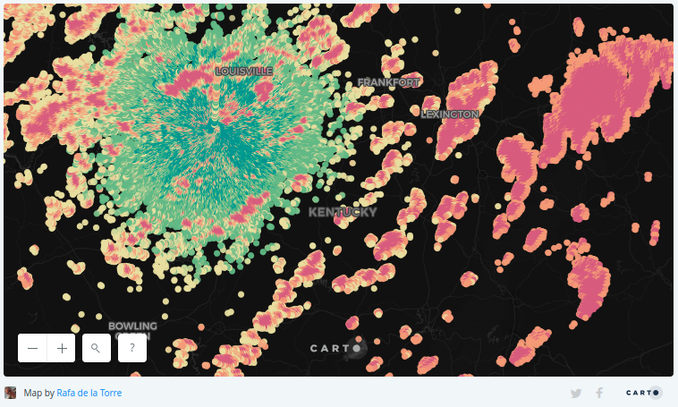

# NEXRAD `copyfrom` example

This is an example of how to use the `CopySQLClient` class and the SQL
API to stream data from a service to a table. In this case we stream
data from the NEXRAD radar data service.

This shows a method that can be used to ingest near real-time
data. Beautiful radar data that can also produce beautiful
visualizations.



For more information about this service and the implementations that
inspired this example, please see:

- https://carto.com/blog/mapping-nexrad-radar-data/
- https://gist.github.com/stuartlynn/a7868cf8ca02931a6408
- http://nbviewer.jupyter.org/gist/dopplershift/356f2e14832e9b676207


## Installation

```sh
cd carto-python/examples/nexrad
virtualenv env # or virtualenv -p python3 env
source env/bin/activate
pip install -r requirements.txt
export CARTO_API_URL=https://YOUR_USER_NAME.carto.com/
export CARTO_API_KEY=YOUR_API_KEY
```

## Usage

```sh
$ python nexrad_copy.py -h
```

```
$ python nexrad_copy.py
INFO:nexrad_copy:Creating table nexrad_copy_example...
INFO:nexrad_copy:Done
INFO:nexrad_copy:Trying to connect to the THREDDS radar query service
INFO:nexrad_copy:Quering data from the station
INFO:nexrad_copy:Avaliable datasets: ['Level2_KLVX_20180822_1536.ar2v']
INFO:nexrad_copy:Using the first one
INFO:nexrad_copy:Got the following data: Nexrad Level 2 Station KLVX from 2018-08-22T15:36:10Z to 2018-08-22T15:40:41Z
INFO:nexrad_copy:Weather Surveillance Radar-1988 Doppler (WSR-88D) Level II data are the three meteorological base data quantities: reflectivity, mean radial velocity, and spectrum width.
INFO:nexrad_copy:Pulling out some of the variables...
INFO:nexrad_copy:ref_data.shape: (720, 1832)
INFO:nexrad_copy:Converting the data...
INFO:nexrad_copy:Done
INFO:nexrad_copy:Executing COPY command...
INFO:nexrad_copy:{u'total_rows': 204789, u'time': 28.805}
```

## About the code

Here are a couple of hints about this example, in case you want to tinker with the code.

## The `copyfrom`

Here's the gist of the code:

```python
def rows():
    for ix, iy in np.ndindex(ref.shape):
        value = ref[ix, iy]
        if value is np.ma.masked:
            continue

        row = u'SRID=4326;POINT({lon} {lat}),{reflectivity}\n'.format(
            lon=lon[ix, iy],
            lat=lat[ix, iy],
            reflectivity=value
        )

        yield row.encode()
```

`rows` is a [generator function](https://wiki.python.org/moin/Generators). When called it returns an object that can be iterated. What it does underneath:
- it traverses all the data, and skip values that were previously masked (i.e. zeroes or no data)
- for every value, it builds a CSV row with the structure specified in the `CREATE TABLE`,
- and finally it _yields_ a row in every iteration.

```python
result = copy_client.copyfrom(
    ('COPY nexrad_copy_example(the_geom, reflectivity)'
     ' FROM stdin WITH (FORMAT csv)'),
    rows())
```

This is the call to the `copyfrom` method. Underneath, the `copyfrom` method will request rows as needed, pack, compress and send them in chunks through the network.


### The query object

Here's the line defining the station to query and the time:

```python
query.stations('KLVX').time(datetime.utcnow())
```

from the `RadarServer` object you can get a list of stations:
```python
In [5]: len(rs.stations)
Out[5]: 159

In [6]: type(rs.stations)
Out[6]: dict

In [7]: rs.stations
Out[7]:
{'KABC': Station(id='KABC', elevation=49.0, latitude=60.78, longitude=-161.87, name='ANCHORAGE/Bethel'),
 'KABR': Station(id='KABR', elevation=397.0, latitude=45.45, longitude=-98.4, name='ABERDEEN/Aberdeen'),
 'KABX': Station(id='KABX', elevation=1789.0, latitude=35.13, longitude=-106.82, name='ALBUQUERQUE/Albuquerque'),
 ...
```

You could also download historical data, which is nicely explained in [dopplershift's jupyter notebook](http://nbviewer.jupyter.org/gist/dopplershift/356f2e14832e9b676207#Download-a-collection-of-historical-data). Mind that with that endpoint you can access up to 2 weeks worth of historical data.

You could even extract high resolution information for each of the samples with a little bit more work:
```python
In [20]: type(data.variables)
Out[20]: collections.OrderedDict

In [21]: len(data.variables)
Out[21]: 72

In [25]: data.variables['timeR_HI'].long_name
Out[25]: u'time of each ray'

In [26]: data.variables['timeR_HI'].units
Out[26]: u'msecs since 2018-08-22T00:00:00Z'
```
